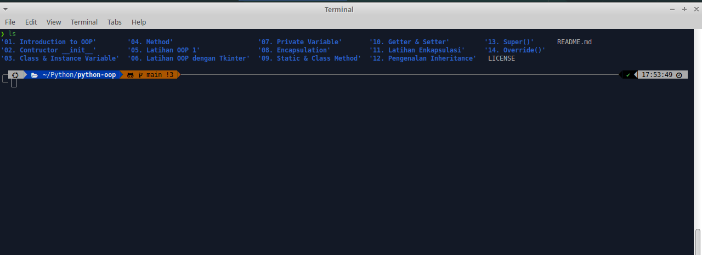

<!-- Improved compatibility of back to top link: See: https://github.com/othneildrew/Best-README-Template/pull/73 -->
<a name="readme-top"></a>
<!--
*** Thanks for checking out the Best-README-Template. If you have a suggestion
*** that would make this better, please fork the repo and create a pull request
*** or simply open an issue with the tag "enhancement".
*** Don't forget to give the project a star!
*** Thanks again! Now go create something AMAZING! :D
-->


<!-- PROJECT SHIELDS -->
<!--
*** I'm using markdown "reference style" links for readability.
*** Reference links are enclosed in brackets [ ] instead of parentheses ( ).
*** See the bottom of this document for the declaration of the reference variables
*** for contributors-url, forks-url, etc. This is an optional, concise syntax you may use.
*** https://www.markdownguide.org/basic-syntax/#reference-style-links
-->
[![Contributors][contributors-shield]][contributors-url]
[![Forks][forks-shield]][forks-url]
[![Stargazers][stars-shield]][stars-url]
[![Issues][issues-shield]][issues-url]
[![MIT License][license-shield]][license-url]
[![LinkedIn][linkedin-shield]][linkedin-url]


<!-- PROJECT LOGO -->
<br />
<div align="center">
  <a href="https://github.com/wijaya5521/python-oop">
    
  </a>

<h3 align="center"><b>Belajar Python OOP</b></h3>

  <p align="center">
    Kumpulan Code Python OOP
    <br />
    <a href="https://github.com/wijaya5521/python-oop"><strong>Explore the docs »</strong></a>
    <br />
    <br />
    <a href="https://github.com/wijaya5521/python-oop">View Demo</a>
    ·
    <a href="https://github.com/wijaya5521/python-oop/issues">Report Bug</a>
    ·
    <a href="https://github.com/wijaya5521/python-oop/issues">Request Feature</a>
  </p>
</div>


<!-- TABLE OF CONTENTS -->
<details>
  <summary>Table of Contents</summary>
  <ol>
    <li>
      <a href="#tentang-project">About The Project</a>
      <ul>
        <li><a href="#built-with">Built With</a></li>
      </ul>
    </li>
    <li>
      <a href="#getting-started">Getting Started</a>
      <ul>
        <li><a href="#prerequisites">Prerequisites</a></li>
        <li><a href="#installation">Installation</a></li>
      </ul>
    </li>
    <li><a href="#usage">Usage</a></li>
    <li><a href="#roadmap">Roadmap</a></li>
    <li><a href="#contributing">Contributing</a></li>
    <li><a href="#license">License</a></li>
    <li><a href="#contact">Contact</a></li>
    <li><a href="#acknowledgments">Acknowledgments</a></li>
  </ol>
</details>


<!-- TENTANG PROJECT -->
## Tentang Project



Python merupakan bahasa pemrograman komputer yang biasa dipakai untuk membangun situs, software/aplikasi, mengotomatiskan tugas dan melakukan analisis data. Bahasa pemrograman ini termasuk bahasa tujuan umum. Artinya, ia bisa digunakan untuk membuat berbagai program berbeda, bukan khusus untuk masalah tertentu saja.

(sumber : [Dicoding](https://www.dicoding.com/blog/python-pengertian-contoh-penggunaan-dan-manfaat-mempelajarinya/))

Repositori ini berisi kumpulan kode dan materi belajar *python object oriented programming*

Anda dapat menggunakannya sebagai sumber belajar secara bebas dan dapat merubah, atau membagikannya kepada orang lain

<p align="right">(<a href="#readme-top">back to top</a>)</p>


## Getting Started
Untuk memulai silakan baca panduannya di bawah ini
terlebih dahulu


### Prerequisites

Beberapa prasyarat ang harus dipenuhi untuk belajar python oop
* Komputer / Laptop
* Sistem Operasi Windows/Mac/Linux
* Python Versi 3.6 atau lebih baru ( disarankan menggunakan python versi terbaru yang dapat diunduh di [Python.org][python-url] )
* Code Editor, anda dapat menggunakan code editor seperti [Visual Studio Code][vscode-url] atau [Pycharm][pycharm-url]
* Pemahaman python dasar, jika anda belum memiliki pemahaman python dasar silakan pelajari di repositori saya yang lain => [Belajar Python Dasar][python-basics-url]
   

### Installation

Untuk instalasi ada beberapa cara yang dapat dilakukan :
* Clone Repository
  ```python
  git clone https://github.com/wijaya5521/python-oop
  ```
* Membaca Langsung di [List Of Directory](#list-of-directory)

<p align="right">(<a href="#readme-top">back to top</a>)</p>


## Usage

Use this space to show useful examples of how a project can be used. Additional screenshots, code examples and demos work well in this space. You may also link to more resources.

_For more examples, please refer to the [Documentation](https://example.com)_

<p align="right">(<a href="#readme-top">back to top</a>)</p>

<!-- LICENSE -->
## License

Distributed under the MIT License. See `LICENSE.txt` for more information.

<p align="right">(<a href="#readme-top">back to top</a>)</p>

<!-- List Of Directory -->
## List Of Directory
<details>
   <summary>Directory Files</summary>
  <ol>
    <li>
      <a href="https://github.com/wijaya5521/python-oop/tree/main/01. Introduction to OOP">Penegenalan OOP</a>
    </li>
  </ol>
</details>


<!-- MARKDOWN LINKS & IMAGES -->
<!-- https://www.markdownguide.org/basic-syntax/#reference-style-links -->

<!-- Contributors-->
[contributors-shield]: https://img.shields.io/github/contributors/wijaya5521/python-oop.svg?style=for-the-badge
[contributors-url]: https://github.com/wijaya5521/python-oop/graphs/contributors

<!-- Forks-->
[forks-shield]: https://img.shields.io/github/forks/wijaya5521/python-oop.svg?style=for-the-badge
[forks-url]: https://github.com/wijaya5521/python-oop/network/members

<!-- Stars-->
[stars-shield]: https://img.shields.io/github/stars/wijaya5521/python-oop.svg?style=for-the-badge
[stars-url]: https://github.com/wijaya5521/python-oop/stargazers

<!-- Issues-->
[issues-shield]: https://img.shields.io/github/issues/wijaya5521/python-oop.svg?style=for-the-badge
[issues-url]: https://github.com/wijaya5521/python-oop/issues

<!-- License-->
[license-shield]: https://img.shields.io/github/license/wijaya5521/python-oop.svg?style=for-the-badge
[license-url]: https://github.com/wijaya5521/python-oop/blob/master/LICENSE.txt

<!-- Linkedin-->
[linkedin-shield]: https://img.shields.io/badge/-LinkedIn-black.svg?style=for-the-badge&logo=linkedin&colorB=555

[linkedin-url]: https://linkedin.com/in/linkedin_username

<!-- VS Code-->
[vscode-url]: https://code.visualstudio.com

<!-- Pycharm-->
[pycharm-url]: https://www.jetbrains.com/pycharm/download

<!-- Python-->
[python-url]: https://www.python.org

<!-- Python Dasar Repositori-->
[python-basics-url]: https://github.com/wijaya5521/python-basics